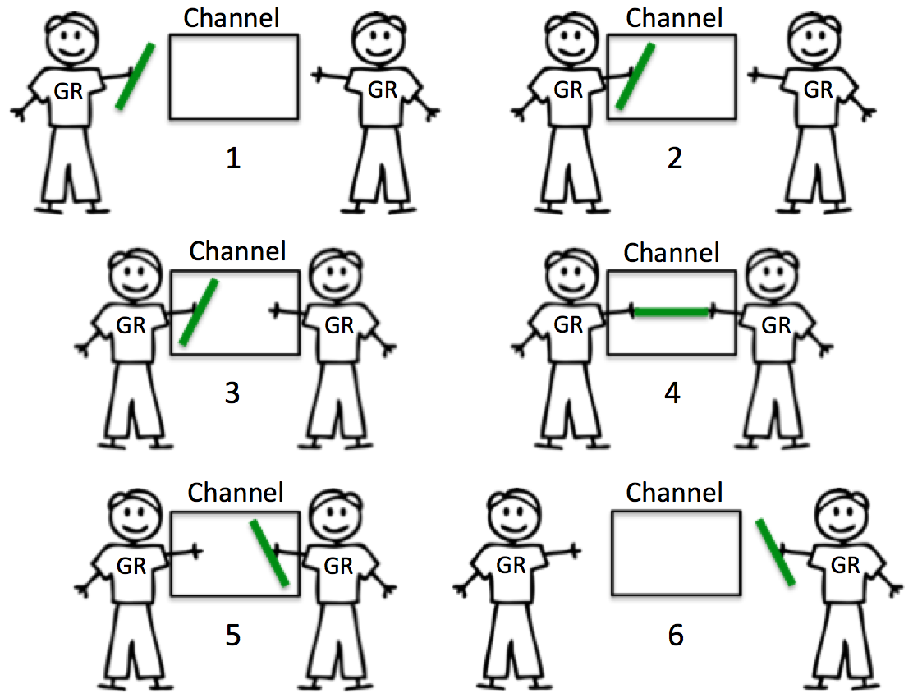

# Channels

**Do not communicate by sharing memory; instead, share memory by communicating.**  

# Links

* [The Nature Of Channels In Go Go, (Golang) Programming - Blog - Ardan Labs](https://www.ardanlabs.com/blog/2014/02/the-nature-of-channels-in-go.html)(**Great**)
* [(Now You're) Thinking With Channels](https://blog.mergermarket.it/now-youre-thinking-with-channels/)(**Great**) 
* [Golang channels tutorial | Alexander Guz's blog](http://guzalexander.com/2013/12/06/golang-channels-tutorial.html)(**Great**)  
* [Channel Axioms | Dave Cheney](https://dave.cheney.net/2014/03/19/channel-axioms)  
* [Curious Channels | Dave Cheney](https://dave.cheney.net/2013/04/30/curious-channels)  
* [Go Concurrency Patterns: Pipelines and cancellation - The Go Blog](https://blog.golang.org/pipelines)  
* [Share Memory By Communicating - The Go Blog](https://blog.golang.org/share-memory-by-communicating)  
* [Codewalk: Share Memory By Communicating](https://golang.org/doc/codewalk/sharemem/)  
* [Never start a goroutine without knowing how it will stop – Dave Cheney](https://dave.cheney.net/2016/12/22/never-start-a-goroutine-without-knowing-how-it-will-stop)


# Builtin
  
* `ch := make(chan int, 100)` | `ch := make(chan int)`
* `close(ch)`
* The `for ... range` on a channel loops over values received from a channel, until the channel is closed.
* The `select` statement can be used to list multiple channel operations such as send on a channel and receive from a channel, and the one that can proceed without blocking will be selected (randomly if there are multiple ones that can proceed; and will block if none is ready).
* There is a special form of the receive operator which allows you to check if the channel was closed (besides receiving a value): `v, ok := <-ch`
* The builtin `len()` function tells the number of elements queued (unread); the builting `cap()` function returns the channel buffer capacity.
  
# Goroutines 
  
A goroutine has a simple model: it is a function executing concurrently with other goroutines in the same address space.
Prefix a function or method call with the go keyword to run the call in a new goroutine. When the call completes, the goroutine exits, silently. (The effect is similar to the Unix shell's & notation for running a command in the background.)  

# Channels basics

## Unbuffered Channels

Unbuffered channels have no capacity and therefore require both goroutines to be ready to make any exchange. When a goroutine attempts to send a resource to an unbuffered channel and there is no goroutine waiting to receive the resource, the channel will lock the sending goroutine and make it wait. When a goroutine attempts to receive from an unbuffered channel, and there is no goroutine waiting to send a resource, the channel will lock the receiving goroutine and make it wait.

**Synchronization** is inherent in the interaction between the send and the receive. **One can not happen without the other**. The nature of an unbuffered channel is guaranteed synchronization.  

  

```go
func main() {
    message := make(chan string) // no buffer
    count := 3

    go func() {
        for i := 1; i <= count; i++ {
            fmt.Printf("send message %d\n", i)
            message <- fmt.Sprintf("message %d", i)
        }
    }()

    time.Sleep(time.Second * 1)
    fmt.Println("Sleep(1s)")

    for i := 1; i <= count; i++ {
        fmt.Println(<-message)
    }
}

/*
send message 1
Sleep(1s)
message 1
send message 2
send message 3
message 2
message 3
*/
```


## Buffered Channels

Buffered channels have capacity and therefore can behave a bit differently. When a goroutine attempts to send a resource to a buffered channel and the channel is full, the channel will lock the goroutine and make it wait until a buffer becomes available. If there is room in the channel, the send can take place immediately and the goroutine can move on. When a goroutine attempts to receive from a buffered channel and the buffered channel is empty, the channel will lock the goroutine and make it wait until a resource has been sent.

Synchronization still occurs within the interactions of receives and sends, however when the queue has buffer availability, the sends will not lock. Receives will not lock when there is something to receive from the channel. Consequently, if the buffer is full or if there is nothing to receive, a buffered channel will behave very much like an unbuffered channel.

  
  
```go
func main() {
    message := make(chan string, 2) 
    count := 3

    // as can see, block send when buffer full. blocked when send message 3
    go func() {
        for i := 1; i <= count; i++ {
            fmt.Printf("send message %d\n", i)
            message <- fmt.Sprintf("message %d", i)
        }
    }()

    time.Sleep(time.Second * 1)
    fmt.Println("Sleep(1s)")

    for i := 1; i <= count; i++ {
        fmt.Println(<-message)
    }
}

/*
send message 1
send message 2
send message 3
Sleep(1s)
message 1
message 2
message 3
*/
```

# When channel will deadlock

1. Only sender or only receiver will deadlock, **One can not happen without the other.**

    ```go
    func main() {
        // fatal error: all goroutines are asleep - deadlock!
        ch := make(chan int)
        ch <- 78
    }

    func main() {
        // fatal error: all goroutines are asleep - deadlock!
        ch := make(chan int)
        <-ch
    }
    ```
1. Send to or receive from a nil channel blocks forever  

    If the channel is nil then the sender and receiver have no reference to each other; they are both blocked waiting on independent channels and will never unblock.  

    ```go
    func main() {
        // fatal error: all goroutines are asleep - deadlock!
        var c chan int
        c <- 78
    }

    func main() {
        // fatal error: all goroutines are asleep - deadlock!
        var c chan int
        <-c
    }
    ```
1. Read more than Sent will deadlock 

    ```go
    func main() {

        ch := make(chan int)
        count := 3

        go func() {
            for i := 1; i <= count; i++ {
                ch <- i
            }
        }()

        for i := 1; i <= count+1; i++ {
            fmt.Println(<-ch)
        }
    }
    /*
    1
    2
    3
    fatal error: all goroutines are asleep - deadlock!
    */
    ```
1. `for v:= range ch` will iterate through channels until the channel is closed. **But** the sender didn't close the channel. will deadlock   
    ```go
    func main() {

        ch := make(chan int)
        count := 3

        go func() {
            for i := 1; i <= count; i++ {
                ch <- i
            }
            // comment out close(ch) will deadlock
            close(ch)
        }()

        for v := range ch {
            fmt.Println(v)
        }
    }
    ```

# When a channel will panic

1. A send to a closed channel panics

    ```go
    // A Fan-in pattern
    func main() {
        var c = make(chan int, 100)
        for i := 0; i < 10; i++ {
            go func() {
                for j := 0; j < 10; j++ {
                    c <- j
                }
                close(c)
            }()
        }
        for i := range c {
            fmt.Println(i)
        }
    }
    // panic: send on closed channel
    ```


# Channel Axioms

* A send to a nil channel blocks forever  
* A receive from a nil channel blocks forever  
* A send to a closed channel panics  
* A receive from a closed channel returns the zero value immediately  

# Interesting Closing a channel

**A closed channel never blocks**  

**a closed channel is always ready to receive.**  

Once a channel has been closed, you cannot send a value on this channel, but you can still receive from the channel.

```go
func main() {

    ch := make(chan bool)
    close(ch)

    for i := 0; i < 3; i++ {
        fmt.Println(<-ch)
    }

}

/*
false
false
false
*/
```

**Use as synchronization tool**  

```go
func main() {

    done := make(chan struct{})

    go func() {
        fmt.Println("goroutine message")
        close(done)
    }()

    fmt.Println("main message")
    <-done
}

/*
main message
goroutine message
*/
```

**really comes into its own when combined with select.**  

declaring `done` to be of type **chan struct{}** says that the channel contains no value; we’re only interested in its closed property.  

```go
package main

import (
    "fmt"
    "sync"
    "time"
)

func main() {

    done := make(chan struct{})
    var wg sync.WaitGroup

    for i := 0; i < 100; i++ {
        wg.Add(1)
        go func() {
            defer wg.Done()
            select {
            case <-time.After(time.Second * 3):
            case <-done:
            }
        }()
    }

    t0 := time.Now()
    // with close(done) comment out, will print:
    // Waited 3.000704702s for 100 goroutine to stop
    close(done)
    wg.Wait()
    fmt.Printf("Waited %v for 100 goroutine to stop\n", time.Since(t0))
    // Waited 55.656µs for 100 goroutine to stop
}
```

# A nil channel always blocks

wait for multiple channels to close

```go
package main

import (
    "fmt"
    "time"
)

func WaitMany(a, b chan bool) {
    for a != nil || b != nil {
        select {
        case <-a:
            a = nil
        case <-b:
            b = nil
        }
    }
    /* wrong way, channel a is closed first can enter an infinite loop
    var aclosed, bclosed bool
    for !aclosed || !bclosed {
            select {
            case <-a:
                    aclosed = true
            case <-b:
                    bclosed = true
            }
    }
    */
}

func main() {
    a, b := make(chan bool), make(chan bool)
    t0 := time.Now()
    go func() {
        close(a)
        close(b)
    }()
    WaitMany(a, b)
    fmt.Printf("waited %v for WaitMany\n", time.Since(t0))
}
```

# [Go Concurrency Patterns: Pipelines and cancellation](https://blog.golang.org/pipelines)

# Guidelines

**There is a pattern to our pipeline functions:**

* **stages close their outbound channels when all the send operations are done.**
* **stages keep receiving values from inbound channels until those channels are closed or the senders are unblocked.**

This pattern allows each receiving stage to be written as a range loop and ensures that all goroutines exit once all values have been successfully sent downstream.  
Pipelines unblock senders either by ensuring there's enough buffer for all the values that are sent or by explicitly signalling senders when the receiver may abandon the channel. 

# Fan-in and Explicit cancellation

因为是要确保所有发送方都完成才能关闭通道,所以只有 Fan-In 有这种问题.

正常都执行完的场景,就是等到等待组都完成再关闭通道就可以了.

如果需要手动取消, 就使用哨子触发等待组完成.

1. make and return output <-chan
2. wg.Add(1) out gr and wg.Done() in gr
3. wg.Wait() and close(output) in another gr  
* Explicit cancellation  
    1. make( chan struct{})
    2. select <-done in gr
    3. close (done) when needed

# pipeline

Informally, a pipeline is a series of stages connected by channels, where each stage is a group of goroutines running the same function. In each stage, the goroutines

* receive values from upstream via inbound channels  
* perform some function on that data, usually producing new values  
* send values downstream via outbound channels  

Each stage has any number of inbound and outbound channels, except the first and last stages, which have only outbound or inbound channels, respectively. The first stage is sometimes called the source or producer; the last stage, the sink or consumer. 

## Squaring numbers

* first stage: 
    producer: 
    `func gen(nums ...int) <-chan int`    
* second stage: 
    can has many this stage
    `func sq(in <-chan int) <-chan int`
* final stage:
    consumer

```go
package main

import (
        "fmt"
)

func gen(nums ...int) <-chan int {
        out := make(chan int)
        go func() {
                for _, n := range nums {
                        out <- n
                }
                close(out)
        }()
        return out
}

func sq(in <-chan int) <-chan int {
        out := make(chan int)
        go func() {
                for n := range in {
                        out <- n * n
                }
                close(out)
        }()
        return out
}

func main() {
        // Set up the pipeline and consume the output.
        for n := range sq(sq(gen(2, 3))) {
                fmt.Println(n) // 16 then 81
        }

}
```

## Fan-out, Fan-in

 Multiple functions can read from the same channel until that channel is closed; this is called fan-out. This provides a way to distribute work amongst a group of workers to parallelize CPU use and I/O.

A function can read from multiple inputs and proceed until all are closed by multiplexing the input channels onto a single channel that's closed when all the inputs are closed. This is called fan-in. 

**Sends on a closed channel panic, so it's important to ensure all sends are done before calling close.** The sync.WaitGroup type provides a simple way to arrange this synchronization

因为是要确保所有发送方都完成才能关闭通道,所以只有 Fan-In 有这种问题.

正常都执行完的场景,就是等到等待组都完成再关闭通道就可以了.

如果需要手动取消, 就使用哨子触发等待组完成.

```go
func merge(cs ...<-chan int) <-chan int {
    var wg sync.WaitGroup
    out := make(chan int)

    // Start an output goroutine for each input channel in cs.  output
    // copies values from c to out until c is closed, then calls wg.Done.
    output := func(c <-chan int) {
        for n := range c {
            out <- n
        }
        wg.Done()
    }
    wg.Add(len(cs))
    for _, c := range cs {
        go output(c)
    }

    // Start a goroutine to close out once all the output goroutines are
    // done.  This must start after the wg.Add call.
    go func() {
        wg.Wait()
        close(out)
    }()
    return out
}

func main() {
    in := gen(2, 3)

    // Distribute the sq work across two goroutines that both read from in.
    c1 := sq(in)
    c2 := sq(in)

    // Consume the merged output from c1 and c2.
    for n := range merge(c1, c2) {
        fmt.Println(n) // 4 then 9, or 9 then 4
    }
}
```

## Explicit cancellation

```go
func main() {
    // Set up a done channel that's shared by the whole pipeline,
    // and close that channel when this pipeline exits, as a signal
    // for all the goroutines we started to exit.
    done := make(chan struct{})
    defer close(done)

    in := gen(done, 2, 3)

    // Distribute the sq work across two goroutines that both read from in.
    c1 := sq(done, in)
    c2 := sq(done, in)

    // Consume the first value from output.
    out := merge(done, c1, c2)
    fmt.Println(<-out) // 4 or 9

    // done will be closed by the deferred call.
}

func merge(done <-chan struct{}, cs ...<-chan int) <-chan int {
    var wg sync.WaitGroup
    out := make(chan int)

    // Start an output goroutine for each input channel in cs.  output
    // copies values from c to out until c or done is closed, then calls
    // wg.Done.
    output := func(c <-chan int) {
        defer wg.Done()
        for n := range c {
            select {
            case out <- n:
            case <-done:
                return
            }
        }
    }
    // ... the rest is unchanged ...

func sq(done <-chan struct{}, in <-chan int) <-chan int {
    out := make(chan int)
    go func() {
        defer close(out)
        for n := range in {
            select {
            case out <- n * n:
            case <-done:
                return
            }
        }
    }()
    return out
}
```
