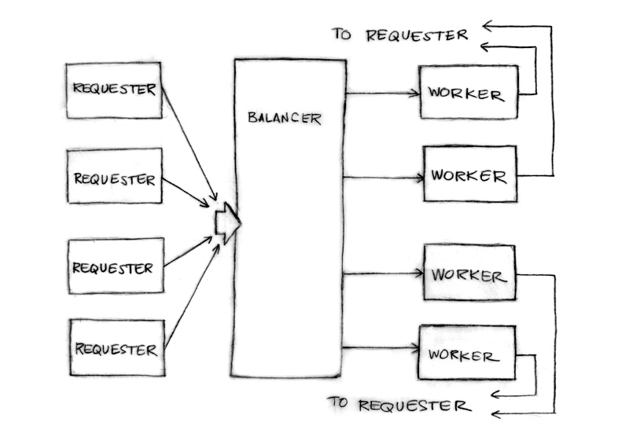

# Concurrency

# Links

* [Visualizing Concurrency in Go](http://divan.github.io/posts/go_concurrency_visualize/)  
* [GopherCon 2016: Ivan Danyliuk - Visualizing Concurrency in Go - YouTube](https://www.youtube.com/watch?v=KyuFeiG3Y60)  
* [Concurrency is not Parallelism](https://talks.golang.org/2012/waza.slide#1)  
* [Rob Pike - 'Concurrency Is Not Parallelism' - YouTube](https://www.youtube.com/watch?v=cN_DpYBzKso)  
* [Google I/O 2010 - Go Programming - YouTube](https://www.youtube.com/watch?v=jgVhBThJdXc) (21:16)    
* [Go Concurrency Patterns](https://talks.golang.org/2012/concurrency.slide#1)  
* [Google I/O 2012 - Go Concurrency Patterns - YouTube](https://www.youtube.com/watch?v=f6kdp27TYZs)  
* [Advanced Go Concurrency Patterns](https://talks.golang.org/2013/advconc.slide#1)  
* [Google I/O 2013 - Advanced Go Concurrency Patterns - YouTube](https://www.youtube.com/watch?v=QDDwwePbDtw)  
* [Go: code that grows with grace](https://talks.golang.org/2012/chat.slide#1)  
* [Scheduling In Go : Part III - Concurrency](https://www.ardanlabs.com/blog/2018/12/scheduling-in-go-part3.html)
* [Golang UK Conference 2017 | Arne Claus - Concurrency Patterns in Go - YouTube](https://www.youtube.com/watch?v=rDRa23k70CU)


# Concurrency Is Not Parallelism

|Concurrency|Parallelism|
|:-------------------------------------------|:------------------------------------------|  
|compositon of **independently** executing things | **simultaneous** execution of multiple things|
|**dealing** with lots of things at once | **doing** lots of things at once| 
|about **structure** | about execution|

# A little background about Go

* Goroutines  
    A goroutine is a function running independently in the same address space as other goroutines   
    Like launching a function with shell's & notation.   
    ```go
    f("hello", "world") // f runs; we wait

    go f("hello", "world") // f starts running
    g() // does not wait for f to return
    ```
* Channels  
    Channels are typed values that allow goroutines to synchronize and exchange information.   
    A sender and receiver must both be ready to play their part in the communication. Otherwise we wait until they are.   
    ```go
    timerChan := make(chan time.Time)
    go func() {
        time.Sleep(deltaT)
        timerChan <- time.Now() // send time on timerChan
    }()
    // Do something else; when ready, receive.
    // Receive will block until timerChan delivers.
    // Value sent is other goroutine's completion time.
    completedAt := <-timerChan
    ```
* Select  
    The select statement is like a switch, but the decision is based on ability to **communicate** rather than equal values. 
    ```go
    select {
    case v := <-ch1:
        fmt.Println("channel 1 sends", v)
    case v := <-ch2:
        fmt.Println("channel 2 sends", v)
    default: // optional
        fmt.Println("neither channel was ready")
    }
    ```
* Closures are also part of the story  
    Make some concurrent calculations easier to express. 

# Launching daemons  

Use a closure to wrap a background operation.
This copies items from the input channel to the output channel:
```go
go func() { // copy input to output
    for val := range input {
        output <- val
    }
}()
```
The for range operation runs until channel is drained. 

# A simple load balancer

```go
// A unit of work:
type Work struct {
    x, y, z int
}

// A worker task 
// Must make sure other workers can run when one blocks. 
func worker(in <-chan *Work, out chan<- *Work) {
   for w := range in {
      w.z = w.x * w.y
      Sleep(w.z)
      out <- w
   }
}

// The runner 
func Run() {
   in, out := make(chan *Work), make(chan *Work)
   for i := 0; i < NumWorkers; i++ {
       go worker(in, out)
   }
   go sendLotsOfWork(in)
   receiveLotsOfResults(out)
}
```

## [a more realistic load balancer](code/lb.go)



# Patterns

[Ping-pong](https://divan.github.io/demos/pingpong/)

```go
package main

import "time"

func main() {
    var Ball int
    table := make(chan int)
    go player(table)
    go player(table)

    table <- Ball
    time.Sleep(1 * time.Second)
    <-table
}

func player(table chan int) {
    for {
        ball := <-table
        ball++
        time.Sleep(100 * time.Millisecond)
        table <- ball
    }
}
```

这种模式的一个明显特征是`FIFO`,起了100个`go player(table)`的[样子](https://divan.github.io/demos/pingpong100/):  
```go
for i := 0; i < 100; i++ {
    go player(table)
}
```

## Generator: function(goroutine inside) that returns a channel  

```go
func main() {
    c := boring("boring!") // Function returning a channel.
    for i := 0; i < 5; i++ {
        fmt.Printf("You say: %q\n", <-c)
    }
    fmt.Println("You're boring; I'm leaving.")
}

func boring(msg string) <-chan string { // Returns receive-only channel of strings.
    c := make(chan string)
    go func() { // We launch the goroutine from inside the function.
        for i := 0; ; i++ {
            c <- fmt.Sprintf("%s %d", msg, i)
            time.Sleep(time.Duration(rand.Intn(1e3)) * time.Millisecond)
        }
    }()
    return c // Return the channel to the caller.
}
```
