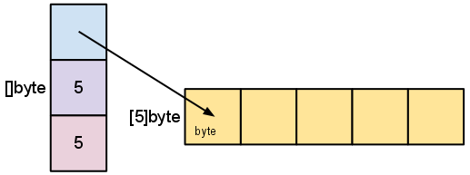

# slices 

#### Links

* [Arrays, slices (and strings): The mechanics of 'append'](https://blog.golang.org/slices)  
* [Go Slices: usage and internals](https://blog.golang.org/go-slices-usage-and-internals)  
* [Go Data Structures](https://research.swtch.com/godata)  
* ["Slice Tricks" Wiki page ](https://golang.org/wiki/SliceTricks)  

#### questions that must be answered  


* fixed-size or variable-size?  
* is the size part of the type?  
* what do multidimensional arrays look like?  
* does the empty array have meaning?  

#### 整理


##### 基本类型在内存中的结构

  

##### 结构和指針

结构的字段(fields)在内存中也是连续的.如果字段是指针,那么它就是指针.  

```go
type Rect1 struct { Min, Max Point }
type Rect2 struct { Min, Max *Point }
```

  


##### Arrays 数组

数组是定长的,长度是类型的一部分. 不同的长度就是不同的类型.比如,[256]byte [512]byte是不同的类型.  

数组在内存中就是固定长度的连续的块.  

##### 切片 和 切片头 Slices: The slice header

直觉上切片就是变长数组的样子.本质上不是,本质上切片一种描述数组片段的数据结构  
它的数据结构本身完全不是数组的样子,完完全全是另一种东西.  
它的数据结构包含字段: 长度, 容量, 0元素指针  

这是它的类型定义:  

```go
type sliceHeader struct {
    Length        int
    Capacity      int
    ZerothElement *byte
}
```

它在内存中的样子:  

  

另一组图:  

  

`make([]byte, 5)`后:  

  

`s = s[2:4]`后:  

  

`s = s[:cap(s)]`后:  

  

**需要知道的是,0元素指针往前移了,就不能回头了**  
那么为什么不设计成可以回头呢?  

##### 传值还是传指针給函数

基本思想就是,对于以传值方式来工作的语言,在函数内部对值本身所作的修改,出了函数就不作数的,因为它是值的一个副本.但可以把这个值通过`return`返回.  
但在函数内,传入指针后,对指针所指向的内容作修改,是会影响到函数外的世界的.  
对于切片来説,传值給函数后,修改元素的值马上生效,修改切片本身需要`return`.  

#### new and make

new(T) returns a *T,  make(T, args) returns an ordinary T.  


  

#### strings

字符串就是只读切片,就是切片没有了容量字段.  

  

#### 扩容切片 copy and append

直觉上会觉得容量等于底层数组的长度,但其实容量是等于底层数组的长度减去切片0元素在数组上的索引.(我总是纠结算这种加减法到底要不要减一或加一的问题,完全没有办法弄清楚)  

普世的扩容思路都一样,创建一个新的大的切片,然后把旧的复制过来.再賦值給旧的变量名,这个时候底层数组已经是另外一条了.成本还是很高的.  

利用内建函数`copy`扩容:  

```go
t := make([]byte, len(s), (cap(s)+1)*2)  // +1 in case cap(s) == 0
copy(t, s)
s = t
```

利用内建函数`append`扩容:  

* b... means "expand b"   
* ...T means "0+ of T"  

```go
func append(s []T, x ...T) []T  

a := []string{"John", "Paul"}
b := []string{"George", "Ringo", "Pete"}
a = append(a, b...) // equivalent to "append(a, b[0], b[1], b[2])"
// a == []string{"John", "Paul", "George", "Ringo", "Pete"}
```

#### 要注意的gotcha

切片的好处就是不用经常分配新内存,那么潜在的问题就是当你切完之后只需要很小的一部分数据,内存里的仍然是原来的大块的所有数据.
解决办法就像扩容那样,创建一个新的小的切片,把旧的数据复制过来,再返回结果.  

#### Nil

理解不了哦:  

```
sliceHeader{
    Length:        0,
    Capacity:      0,
    ZerothElement: nil,
}
```

or just

`sliceHeader{}`

The key detail is that the element pointer is nil too. The slice created by

`array[0:0]`

has length zero (and maybe even capacity zero) but its pointer is not nil, so it is not a nil slice. 

//这句話是想説啥?  
**As should be clear, an empty slice can grow (assuming it has non-zero capacity), but a nil slice has no array to put values in and can never grow to hold even one element.**

That said, a nil slice is functionally equivalent to a zero-length slice, even though it points to nothing. It has length zero and can be appended to, with allocation.

#### Conclusion

切片头变来变去,底层数组恒久远.  

#### 深入了解 copy 和 append


```go

// append
a = append(a, b...)

// copy
b = make([]T, len(a))
copy(b, a)
// or
b = append([]T(nil), a...)

// cut
// 意外不意外,用append实现了cut
// 更让我意外的是,这个cut掉的是a[i:j-1]这一段,而不是a[i-1:j-1]这一段
// 因为a[i:j]是左闭右开的,意思是from i til j, 也就是x >= i && x < j
// 所以a[0:0]是不包含a[0]的
a = append(a[:i], a[j:]...)

// delete
a = append(a[:i], a[i+1:]...)
// or
a = a[:i+copy(a[i:], a[i+1:])]

// Delete without preserving order
a[i] = a[len(a)-1] 
a = a[:len(a)-1]


// NOTE If the type of the element is a pointer or a struct with pointer fields, which need to be garbage collected, the above implementations of Cut and Delete have a potential memory leak problem: some elements with values are still referenced by slice a and thus can not be collected. The following code can fix this problem:

// Cut
copy(a[i:], a[j:])
for k, n := len(a)-j+i, len(a); k < n; k++ {
    a[k] = nil // or the zero value of T
}
a = a[:len(a)-j+i]

// Delete
copy(a[i:], a[i+1:])
a[len(a)-1] = nil // or the zero value of T
a = a[:len(a)-1]

// Delete without preserving order
a[i] = a[len(a)-1]
a[len(a)-1] = nil
a = a[:len(a)-1]


// Expand
a = append(a[:i], append(make([]T, j), a[i:]...)...)

// Extend
a = append(a, make([]T, j)...)

// Insert
s = append(s, 0)
copy(s[i+1:], s[i:])
s[i] = x


// Pop/Shift
x, a = a[0], a[1:]

// Pop Back
x, a = a[len(a)-1], a[:len(a)-1]

// Push
a = append(a, x)

// Push Front/Unshift
a = append([]T{x}, a...)

// Filtering without allocating
// This trick uses the fact that a slice shares the same backing array and capacity as the original, so the storage is reused for the filtered slice. Of course, the original contents are modified.
b := a[:0]
for _, x := range a {
    if f(x) {
        b = append(b, x)
    }
}

// Reversing
// To replace the contents of a slice with the same elements but in reverse order:
for i := len(a)/2-1; i >= 0; i-- {
    opp := len(a)-1-i
    a[i], a[opp] = a[opp], a[i]
}

// The same thing, except with two indices:
for left, right := 0, len(a)-1; left < right; left, right = left+1, right-1 {
    a[left], a[right] = a[right], a[left]
}

// Shuffling
// Fisher–Yates algorithm:
for i := len(a) - 1; i > 0; i-- {
    j := rand.Intn(i + 1)
    a[i], a[j] = a[j], a[i]
}

```

