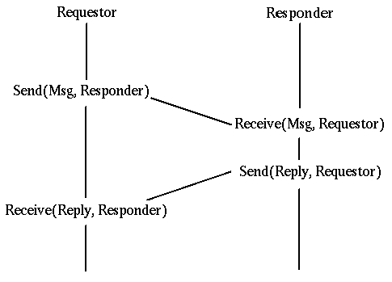
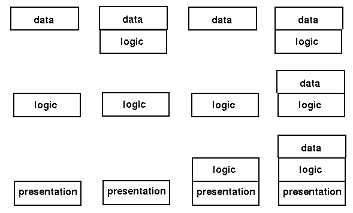

# Socket

# Links

* [Network Programming with Go (golang)](https://ipfs.io/ipfs/QmfYeDhGH9bZzihBUDEQbCbTc5k5FZKURMUoUvfmc27BwL/index.html)
* [Tech Stuff - TCP/IP Message (TCP, UDP, ICMP and IP) Formats](http://www.zytrax.com/tech/protocols/tcp.html)
* [面向报文（UDP）和面向字节流（TCP）的区别 - CSDN博客](https://blog.csdn.net/ce123_zhouwei/article/details/8976006)

# ISO OSI Protocol

# TCP/IP Protocol

# Some Alternative Protocols

Firewire USB Bluetooth WiFi

# Packet encapsulation

# Connection Models

There are two major models for this:

* Connection oriented
* Connectionless

## Connection oriented

A single connection is established for the session. Two-way communications flow along the connection. 
When the session is over, the connection is broken. 
The analogy is to a phone conversation. An example is TCP

## Connectionless

In a connectionless system, messages are sent independent of each other. 
Ordinary mail is the analogy. 
Connectionless messages may arrive out of order. An example is the IP protocol.

Connection oriented transports may be established on top of connectionless ones - TCP over IP. 
Connectionless transports my be established on top of connection oriented ones - HTTP over TCP.

# Communications Models

## Message passing

Some non-procedural languages are built on the principle of message passing. Concurrent languages often use such a mechanism

## Remote procedure call

In any system, there is a transfer of information and **flow control** from one part of the system to another.

# Distributed Computing Models

## Server Distribution

multiple clients, single server 

single client, multiple servers , occurs frequently when a server needs to act as a client to other servers

## Component Distribution

* Presentation component
* Application logic
* Data access

# Gartner Classification

## five models

* model 1: Google maps
* model 2: NFS
* model 3: Web{html, java, cgi, httpd}
* model 4: terminal emulation
* model 5: X Window System 

## Three Tier Models

Of course, if you have two tiers, then you can have three, four, or more.

## Middleware model

# Continuum of Processing

# Points of Failure

* The client side of the application could crash
* The client system may have h/w problems
* The client's network card could fail
* Network contention could cause timeouts
* There may be network address conflicts
* Network elements such as routers could fail
* Transmission errors may lose messages
* The client and server versions may be incompatible
* The server's network card could fail
* The server system may have h/w problems
* The server s/w may crash
* The server's database may become corrupted

# Acceptance Factors

* Reliability
* Performance
* Responsiveness
* Scalability
* Capacity
* Security

# Transparency

* access transparency
* location transparency
* migration transparency
* replication transparency
* concurrency transparency
* scalability transparency
* performance transparency
* failure transparency

# Eight fallacies of distributed computing

* The network is reliable.
* Latency is zero.
* Bandwidth is infinite.
* The network is secure.
* Topology doesn't change.
* There is one administrator.
* Transport cost is zero.
* The network is homogeneous.

