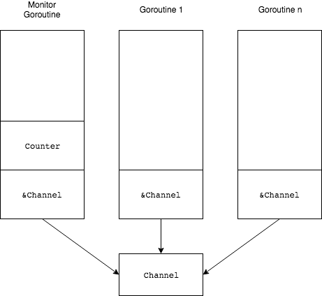

# Monitor goroutines

# Links

* [Golang: Concurrency: Monitors and Mutexes, A (light) Survey](https://medium.com/dm03514-tech-blog/golang-monitors-and-mutexes-a-light-survey-84f04f9b7c09)


```go
func NewCounterMonitor(ctx context.Context) chan <- int {
   ch := make(chan int)

   go func() {
      counter := 0
	  for {
         select {
            case i, ok := <-ch:
               if !ok {
                   return
               }
               counter += i
            case <-ctx.Done():
               fmt.Printf("final_count: %d\n", counter)
               return
         }
      }
   }()

   return ch
}
```

From [Golang: Concurrency: Monitors and Mutexes, A (light) Survey](https://medium.com/dm03514-tech-blog/golang-monitors-and-mutexes-a-light-survey-84f04f9b7c09):




