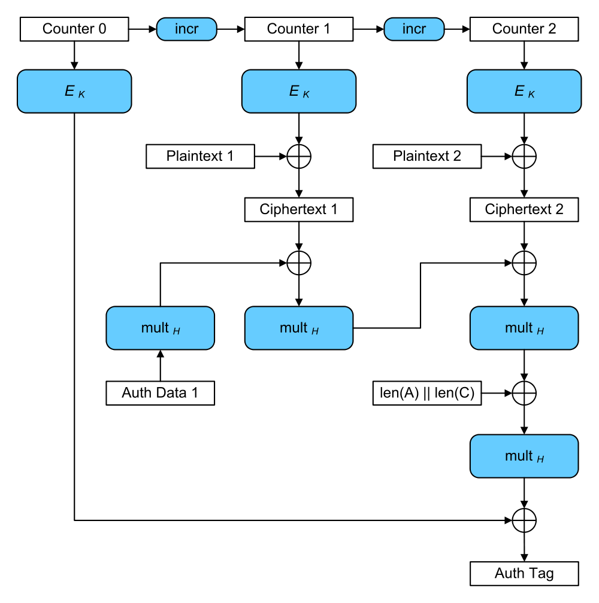

# [Package cipher](https://golang.org/pkg/crypto/cipher/)

# Links

* [密码学 - 维基百科，自由的百科全书](https://zh.wikipedia.org/wiki/%E5%AF%86%E7%A0%81%E5%AD%A6)
* [分组密码工作模式 - 维基百科，自由的百科全书](https://zh.wikipedia.org/zh-hans/%E5%88%86%E7%BB%84%E5%AF%86%E7%A0%81%E5%B7%A5%E4%BD%9C%E6%A8%A1%E5%BC%8F)
* [Shadowsocks - AEAD Ciphers](https://shadowsocks.org/en/spec/AEAD-Ciphers.html)
* [cryptography - Lessons learned and misconceptions regarding encryption and cryptology - Information Security Stack Exchange](https://security.stackexchange.com/questions/2202/lessons-learned-and-misconceptions-regarding-encryption-and-cryptology)
* [ImperialViolet - AEADs: getting better at symmetric cryptography](https://www.imperialviolet.org/2015/05/16/aeads.html)
* [认证加密 - 维基百科，自由的百科全书](https://zh.wikipedia.org/wiki/%E8%AE%A4%E8%AF%81%E5%8A%A0%E5%AF%86)
* [Galois/Counter Mode - Wikipedia](https://en.wikipedia.org/wiki/Galois/Counter_Mode)

# Package files

[cipher.go](https://golang.org/src/crypto/cipher/cipher.go) [io.go](https://golang.org/src/crypto/cipher/io.go)

# Overview

这些都是指块密码加密法的工作模式: ECB，CBC，OFB, CFB

ECB: Electronic codebook

	同样的平文块会被加密成相同的密文块

CBC: Cipher block chaining 中文意思是"密码块链"；1976年，IBM发明

CFB: Cipher feedback, 和CBC类似

上面几种都是比较老的.2001年后,有了新的标准:AES.这个标准下的新的工作模式: CTR, 

CTR: Counter mode

**AES(Advanced Encryption Standard) : 這個標準用來替代原先的DES(Data Encryption Standard).**

现在新的一类模式叫AE(Authenticated Encryption),中文意思是认证过的加密,这类的工作模式: GCM

AEAD: authenticated encryption with associated data


# Block接口和BlockMode接口

aes.NewCipher函数生成cipher.Block接口`func NewCipher(key []byte) (cipher.Block, error)`

NewCBCEncrypter returns a BlockMode which encrypts in cipher block chaining mode, using the given Block. The length of iv must be the same as the Block's block size. 

```go
type Block interface {
    BlockSize() int
    Encrypt(dst, src []byte)
    Decrypt(dst, src []byte)
}

type BlockMode interface {
    BlockSize() int
    CryptBlocks(dst, src []byte)
}

func NewCBCEncrypter(b Block, iv []byte) BlockMode
func NewCBCDecrypter(b Block, iv []byte) BlockMode
```

## Examples

[05cipher/cbc.go](https://github.com/iofxl/practisego/blob/master/05cipher/cbc.go)


# Stream接口

基本使法应该是通过StreamReader, StreamWriter结构来读写的。


```go
type Stream interface {
    XORKeyStream(dst, src []byte)
}

func NewCFBEncrypter(block Block, iv []byte) Stream
func NewCFBDecrypter(block Block, iv []byte) Stream

func NewCTR(block Block, iv []byte) Stream
func NewOFB(b Block, iv []byte) Stream
```

# StreamReader和StreamWriter结构

```go
type StreamReader struct {
        S Stream
        R io.Reader
}

func (r StreamReader) Read(dst []byte) (n int, err error) {
    n, err = r.R.Read(dst)
    r.S.XORKeyStream(dst[:n], dst[:n])
    return
}

type StreamWriter struct {
    S   Stream
    W   io.Writer
}

func (w StreamWriter) Write(src []byte) (n int, err error) 
func (w StreamWriter) Close() error
```

## Examples

# AEAD接口

AEAD接口中的Seal函数就是加密, Open函数就是解密

```go
type AEAD interface {
    NonceSize() int
    Overhead() int
    Seal(dst, nonce, plaintext, additionalData []byte) []byte
    Open(dst, nonce, ciphertext, additionalData []byte) ([]byte, error)
}

func NewGCM(cipher Block) (AEAD, error)
func NewGCMWithNonceSize(cipher Block, size int) (AEAD, error)
func NewGCMWithTagSize(cipher Block, tagSize int) (AEAD, error)
```

## Examples

[gcm.go](https://github.com/iofxl/practisego/blob/master/05cipher/gcm.go)

# CTR

本来想去理解一下不同块密码工作模式的算法 瞅不懂

CFB与CBC相似，明文的改变会影响接下来所有的密文，因此加密过程不能并行化；而同样的，与CBC类似，解密过程是可以并行化的。

每个使用OFB的输出块与其前面所有的输出块相关，因此不能并行化处理。然而，由于明文和密文只在最终的异或过程中使用，因此可以事先对IV进行加密，最后并行的将明文或密文进行并行的异或处理。

可以利用输入全0的CBC模式产生OFB模式的密钥流。这种方法十分实用，因为可以利用快速的CBC硬件实现来加速OFB模式的加密过程。 

CTR模式的特征类似于OFB，但它允许在解密时进行随机存取。由于**加密和解密过程均可以进行并行处理**，CTR适合运用于多处理器的硬件上。 


# GCM Principle

Although not completely standard, I differentiate an IV and an nonce thus: **an IV needs to be unpredictable** while **an nonce needs only to be distinct**. 



