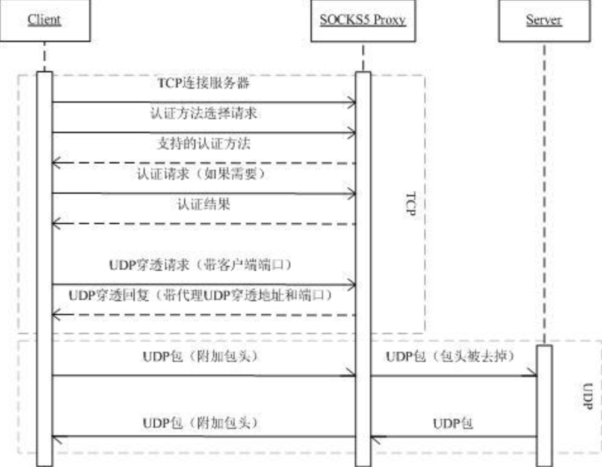

# SOCKS5

# Links

* [RFC 1928 - SOCKS Protocol Version 5](https://tools.ietf.org/html/rfc1928) 
* [socks5协议理解(TCP/UDP) - 简书](https://www.jianshu.com/p/6fc3fd5dd5ea)
* [一个简单的Golang实现的Socks5 Proxy - 简书](https://www.jianshu.com/p/172810a70fad)
* [socks - GoDoc](https://godoc.org/golang.org/x/net/internal/socks)

**Q:** 代理UDP的时候，UDP报文是包在TCP链接里的，还是仍然是UDP 的报文 ？

**A:** 事实是仍然是UDP的。不过像shadowsocks这种做法，套进TCP里也会得的

**TCP VS UDP**

首先呢，不认为这是两个不同的东西，其实统都一样的，统都socket跟socket之间的byte
而已，区别不过是如何去解析协议而已

TCP是有连接的，UDP是无连接的，其实所谓有连接，就是过来的报文的包头底层会去处理
的。而UDP是要去解析包头的

所以也有另外一种曰法，TCP是面向内容的，UDP是面向报文的，这些统都搞些概念，使简
单的东西复杂起

# Message and Data Format

# Message Format

* Negotiation  
	1. The client connects to the server, and sends a version
	   identifier/method selection message.
	2. The server selects from one of the methods given in METHODS, and
	   sends a METHOD selection message.
* Requests  
	1. Once the method-dependent subnegotiation has completed, the client
	   sends the request details.
	2. The server evaluates the request, and returns a reply.
* Reply Processing  
	   When a reply (REP value other than X'00') indicates a failure, the
	   SOCKS server MUST terminate the TCP connection shortly after sending
	   the reply.  This must be no more than 10 seconds after detecting the
	   condition that caused a failure.  
	   If the reply code (REP value of X'00') indicates a success, and the
	   request was either a BIND or a CONNECT, the client may now start
	   passing data. 

# Data Format

数据格式是去表达消息格式的

There are two main format choices for messages: **byte encoded** or **character
encoded**.

socks5 is `byte encoded`.

* Negotiation  
	1. The client connects to the server, and sends a version
	   identifier/method selection message.  

			   +----+----------+----------+
			   |VER | NMETHODS | METHODS  |
			   +----+----------+----------+
			   | 1  |    1     | 1 to 255 |
			   +----+----------+----------+
	2. The server selects from one of the methods given in METHODS, and
	   sends a METHOD selection message.  

				 +----+--------+
				 |VER | METHOD |
				 +----+--------+
				 | 1  |   1    |
				 +----+--------+
* Requests  
	1. Once the method-dependent subnegotiation has completed, the client
	   sends the request details.  

			+----+-----+-------+------+----------+----------+
			|VER | CMD |  RSV  | ATYP | DST.ADDR | DST.PORT |
			+----+-----+-------+------+----------+----------+
			| 1  |  1  | X'00' |  1   | Variable |    2     |
			+----+-----+-------+------+----------+----------+
	2. The server evaluates the request, and returns a reply.  

			+----+-----+-------+------+----------+----------+
			|VER | REP |  RSV  | ATYP | BND.ADDR | BND.PORT |
			+----+-----+-------+------+----------+----------+
			| 1  |  1  | X'00' |  1   | Variable |    2     |
			+----+-----+-------+------+----------+----------+
