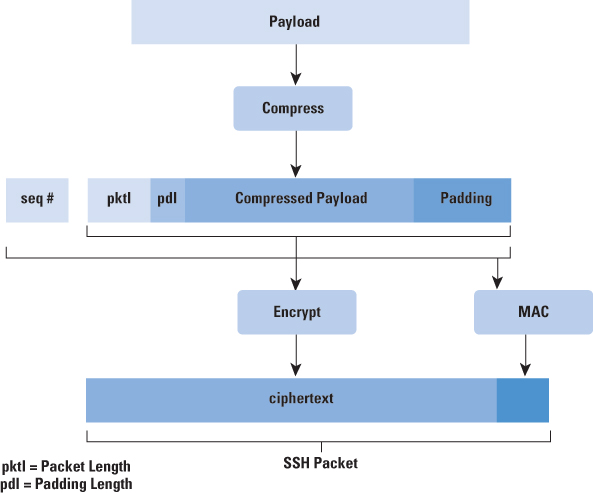
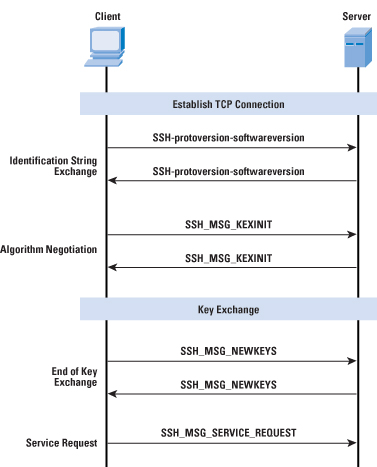

# SSH

# Links

* [Protocol Basics: Secure Shell Protocol - The Internet Protocol Journal, Volume 12, No.4 - Cisco](https://www.cisco.com/c/en/us/about/press/internet-protocol-journal/back-issues/table-contents-46/124-ssh.html)
* [RFC 4251 - The Secure Shell (SSH) Protocol Architecture](https://tools.ietf.org/html/rfc4251)
* [RFC 4252 - The Secure Shell (SSH) Authentication Protocol](https://tools.ietf.org/html/rfc4252)
* [RFC 4253 - The Secure Shell (SSH) Transport Layer Protocol](https://tools.ietf.org/html/rfc4253)

# Packet

	Each packet is in the following format:

		uint32    packet_length
		byte      padding_length
		byte[n1]  payload; n1 = packet_length - padding_length - 1
		byte[n2]  random padding; n2 = padding_length
		byte[m]   mac (Message Authentication Code - MAC); m = mac_length

From: [https://www.cisco.com/c/dam/en_us/about/ac123/ac147/images/ipj/ipj_12-4/124_ssh_fig03_sm.jpg](https://www.cisco.com/c/dam/en_us/about/ac123/ac147/images/ipj/ipj_12-4/124_ssh_fig03_lg.jpg)

# Steps

From: [https://www.cisco.com/c/dam/en_us/about/ac123/ac147/images/ipj/ipj_12-4/124_ssh_fig02_sm.jpg](https://www.cisco.com/c/dam/en_us/about/ac123/ac147/images/ipj/ipj_12-4/124_ssh_fig02_lg.jpg)

# Architecture

	It consists of three major components:

	o  The Transport Layer Protocol [SSH-TRANS] provides server
		authentication, confidentiality, and integrity.  It may optionally
		also provide compression.  The transport layer will typically be
		run over a TCP/IP connection, but might also be used on top of any
		other reliable data stream.

	o  The User Authentication Protocol [SSH-USERAUTH] authenticates the
		client-side user to the server.  It runs over the transport layer
		protocol.

	o  The Connection Protocol [SSH-CONNECT] multiplexes the encrypted
		tunnel into several logical channels.  It runs over the user
		authentication protocol.

## Host Keys

The way we normally use ssh are wrong.

	Two different trust models can be used:

	o  The client has a local database that associates each host name (as
		typed by the user) with the corresponding public host key.  This
		method requires no centrally administered infrastructure, and no
		third-party coordination.  The downside is that the database of
		name-to-key associations may become burdensome to maintain.

	o  The host name-to-key association is certified by a trusted
		certification authority (CA).  The client only knows the CA root
		key, and can verify the validity of all host keys certified by
		accepted CAs.

