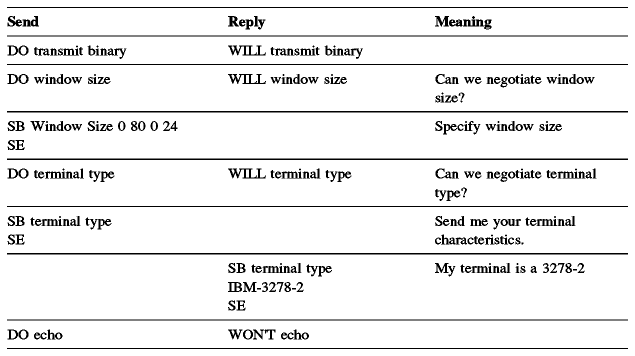

# TELNET

# Links

* [RFC 854 - Telnet Protocol Specification](https://tools.ietf.org/html/rfc854)
* [THE TELNET PROTOCOL](http://mars.netanya.ac.il/~unesco/cdrom/booklet/HTML/NETWORKING/node300.html)
* [telnet - GoDoc](https://godoc.org/github.com/ziutek/telnet)


INTRODUCTION

   The purpose of the TELNET Protocol is to provide a fairly general,
   bi-directional, eight-bit byte oriented communications facility.  Its
   primary goal is to allow a standard method of interfacing terminal
   devices and terminal-oriented processes to each other.  It is
   envisioned that the protocol may also be used for terminal-terminal
   communication ("linking") and process-process communication
   (distributed computation).


GENERAL CONSIDERATIONS

   A TELNET connection is a Transmission Control Protocol (TCP)
   connection used to transmit data with interspersed TELNET control
   information.

   The TELNET Protocol is built upon three main ideas:  first, the
   concept of a "Network Virtual Terminal"; second, the principle of
   negotiated options; and third, a symmetric view of terminals and
   processes.


   In summary, WILL XXX is sent, by either party, to indicate that
   party's desire (offer) to begin performing option XXX, DO XXX and
   DON'T XXX being its positive and negative acknowledgments; similarly,
   DO XXX is sent to indicate a desire (request) that the other party
   (i.e., the recipient of the DO) begin performing option XXX, WILL XXX
   and WON'T XXX being the positive and negative acknowledgments.  Since
   the NVT is what is left when no options are enabled, the DON'T and
   WON'T responses are guaranteed to leave the connection in a state
   which both ends can handle.  Thus, all hosts may implement their
   TELNET processes to be totally unaware of options that are not
   supported, simply returning a rejection to (i.e., refusing) any
   option request that cannot be understood.


# How it works 

* Once the connection has been established, the client program accepts keystrokes from the user and relays them, generally **one character at a time**, to the TELNET server. 
* The server on the destination machine accepts the characters sent to it by the client, and passes them to a terminal server. 
* A "terminal server" is just some facility provided by the operating system for entering keystrokes from a user's keyboard. 

...

*  To accomodate this heterogeneity, TELNET defines a Network Virtual Terminal (NVT). Any user TELNETting in to a remote site is deemed to be on an NVT, regardless of the actual terminal type being used.
* It is the responsibility of the client program to translate user keystrokes from the actual terminal type into NVT format, and of the server program to translate NVT characters into the format needed by the destination host. For data sent back from the destination host, the translation is the reverse. 
* NVT format defines all characters to be 8 bits (one byte) long. At startup, 7 bit US ASCII is used for data; bytes with the high order bit = 1 are command sequences. 
* The 128 7-bit long US ASCII characters are divided into 95 printable characters and 33 control codes. NVT maps the 95 printable characters into their defined values - decimal 65 = "A", decimal 97 = "a", etc. 
* The 33 control codes are defined for NVT as:

```
    ASCII Code    Decimal value      Meaning
      NUL            0               NO - OP
      BEL            7               Ring "terminal bell"
      BS             8               Backspace; move cursor left
      HT             9               Horizontal tab; move cursor right
      LF            10               Line feed; move down one line;
                                     stay in same column
      VT            11               Vertical tab; move cursor down
      FF            12               Form Feed
      CR            13               Carriage return; move cursor to
                                     beginning of current line
      all others                     NO - OP
  
      CTRL-GHIJKLM == 7 - 13
```

* NVT defines end-of-line to be a CR-LF combination - the two-character sequence. 
* In addition to the 128 characters mentioned above, there are 128 other possible characters in an 8-bit encoding scheme. NVT uses these 128 (with decimal values 128 through 255, inclusive) to pass control functions from client to server. 


	So:

	TELNET only knows value between 0-255, some of these value has special meaning.


// interesting
* A symmetric view of terminals and processes . 
* Because of the symmetric model used by TELNET, both the host and the client may propose additional options to be used.
* The set of options is not part of the TELNET protocol, so that new terminal features can be incorporated without changing the TELNET protocol (mouse?). 
* Commands start with a special character called the Interpret as Command escape character (IAC). 
* The IAC code is 255. 
* If a 255 is sent as data - it must be followed by another 255 


# The NVT (Network Virtual Terminal) concept

* The NVT has a "printer" (or display) and a "keyboard".
* The keyboard produces outgoing data, which is sent over the TELNET connection. The printer receives the incoming data.
* The basic characteristics of an NVT, unless they are modified by mutually agreed options are:
	* The data representation is 7-bit ASCII transmitted in 8-bit bytes.
	* The NVT is a half-duplex device operating in a line-buffered mode.
	* The NVT provides a local echo function. 
* All of these may be negotiated by the two hosts. 


* An NVT Printer has an unspecified carriage width and page length. It can handle printable ASCII characters (ASCII code 32 to 126) and understands some ASCII control characters such as: 


# TELNET Command Structure 

* All internal TELNET commands consist of 2 or 3-byte sequences, depending on the command type.
* The Interpret As Command (IAC) character is followed by a command code. If this command deals with option negotiation, the command will have a third byte to show the code for the referenced option. 


* The key point is that, in order for any byte to be accepted as a command, it must be preceded by a byte with value 255 - "Interpret as Command" (IAC). Otherwise, the server program assumes that that byte is simply data that will be understood by the application program. 
* This command proposes negotiation about terminal type. 


# Option Negotiation 

* Using internal commands, TELNET in each host is able to negotiate options.
* The starting base of negotiation is the NVT capability: each host to be connected must agree to this minimum.
* Every option can be negotiated by the use of the four command codes WILL, WON'T, DO, DON'T described above.
* In addition, some options have sub-options: if both parties agree to the option, they use the SB and SE commands to manage the sub-negotiation.
* Here is a simplified example of how option negotiation works. 



* To use an option, the client and server must negotiate and agree to use it. The tools for negotiation are the commands we've already talked about. One side - usually, but not always, the client - sends a "WILL X" packet (WILL is decimal value 251), where X is the option it wants to use (numeric values for X are given on p. 373). The other side will respond with a DO X or a DON'T X, depending on whether it is willing to support the option.
* Alternatively, the first side could send a "DO X" packet, in which case the response is either "WILL X" or "WON'T X".
* TELNET is one of the programs that requires the TCP Urgent Data function, because buffers may fill up (for example, if a program being executed is in an infinite loop), and the server's program will stop reading data - including the "IP" command the user sent after he realized what was happening. The packet with the "Terminate" command can be sent as "urgent data" at the TCP level; that will bypass the standard TCP flow controls and enable an out-of-control process to be stopped. 


# TELNET Basic Commands 

* The primary goal of the TELNET protocol is the provision of a standard interface for hosts over a network.
* To allow the connection to start, the TELNET protocol defines a standard representation for some functions: 

```
  IP     Interrupt Process 
  AO     Abort Output 
  AYT    Are You There 
  EC     Erase Character 
  EL     Erase Line 
  SYNCH  Synchronize 
  QUIT   quit session 
```  

# Yet another review of TELNET 

```
   Commands      Code No.   Description 
                 Dec Hex 
   ----------------------------------------------------------------
   data                     All terminal input/output data. 
   End subNeg    240 FO     End of option subnegotiation command. 
   No Operation  241 F1     No operation command. 
   Data Mark     242 F2     End of urgent data stream. 
   Break         243 F3     Operator pressed the Break key or the
                            Attention key. 
   Int process   244 F4     Interrupt current process. 
   Abort output  245 F5     Cancel output from current process. 
   You there?    246 F6     Request acknowledgment. 
   Erase char    247 F7     Request that operator erase the previous
                              character. 
   Erase line    248 F8     Request that operator erase the previous
                              line. 
   Go ahead!     249 F9     End of input for half-duplex connections.
   SubNegotiate  250 FA     Begin option subnegotiation. 
   Will Use      251 FB     Agreement to use the specified option. 
   Won’t Use     252 FC     Reject the proposed option. 
   Start use     253 FD     Request to start using specified option. 
   Stop Use      254 FE     Demand to stop using specified option. 
   IAC           255 FF     Interpret as command. 
```
* Each negotiable option has an ID, which immediately follows the command for option negotiation, that is, IAC: command, option code. Following is a list of TELNET option codes: 

```
   Option ID     Option Codes     Description 
   Dec Hex
   -------------------------------------------------------------------
    0  0         Binary Xmit      Allows transmission of binary data. 
    1  1         Echo Data        Causes server to echo back
                                  all keystrokes.
    2  2         Reconnect        Reconnects to another TELNET host. 
    3  3         Suppress GA      Disables Go Ahead! command. 
    4  4         Message Sz       Conveys approximate message size. 
    5  5         Opt Status       Lists status of options. 
    6  6         Timing Mark      Marks a data stream position for
                                  reference. 
    7  7         R/C XmtEcho      Allows remote control of terminal
                                  printers. 
    8  8         Line Width       Sets output line width. 
    9  9         Page Length      Sets page length in lines. 
   10  A        CR Use            Determines handling of carriage returns. 
   11  B        Horiz Tabs        Sets horizontal tabs. 
   12  C        Hor Tab Use       Determines handling of horizontal tabs. 
   13  D        FF Use            Determines handling of form feeds. 
   14  E        Vert Tabs         Sets vertical tabs. 
   15  F        Ver Tab Use       Determines handling of vertical tabs. 
   16 10       Lf Use             Determines handling of line feeds. 
   17 11       Ext ASCII          Defines extended ASCII characters. 
   18 12       Logout             Allows for forced log-off. 
   19 13       Byte Macro         Defines byte macros. 
   20 14       Data Term          Allows subcommands for Data Entry to
                                  be sent. 
   21 15       SUPDUP             Allows use of SUPDUP display protocol. 
   22 16       SUPDUP Outp        Allows sending of SUPDUP output. 
   23 17       Send Locate        Allows terminal location to be sent. 
   24 18       Term Type          Allows exchange of terminal type
                                  information. 
   25 19       End Record         Allows use of the End of record code
                                  (0xEF). 
   26 1A       TACACS ID          User ID exchange used to avoid more
                                  than 1 log-in. 
   27 1B       Output Mark        Allows banner markings to be sent on
                                  output. 
   28 1C       Term Loc#          A numeric ID used to identify terminals. 
   29 1D       3270 Regime        Allows emulation of 3270 family
                                  terminals. 
   30 1E       X.3 PAD            Allows use of X.3 protocol emulation. 
   31 1F       Window Size        Conveys window size for emulation
                                  screen. 
   32 20       Term Speed         Conveys baud rate information. 
   33 21       Remote Flow        Provides flow control (XON, XOFF). 
   34 22       Linemode           Provides linemode bulk character
                                  transactions. 
   255 FF      Extended           options list  Extended options list. 
```


