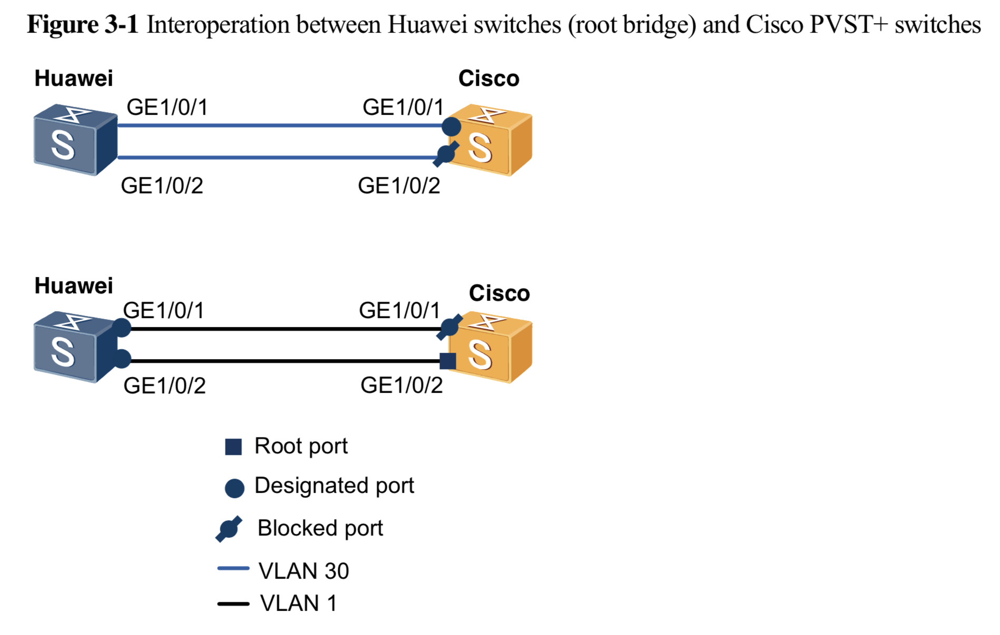
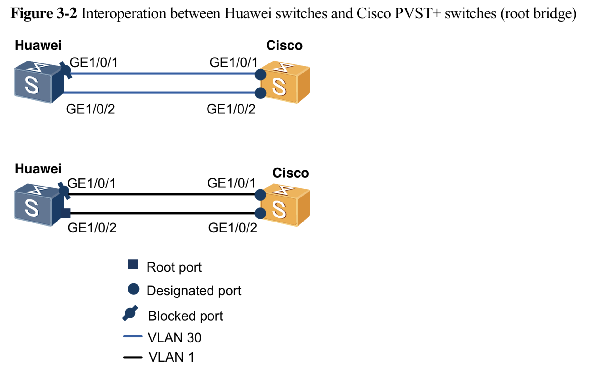
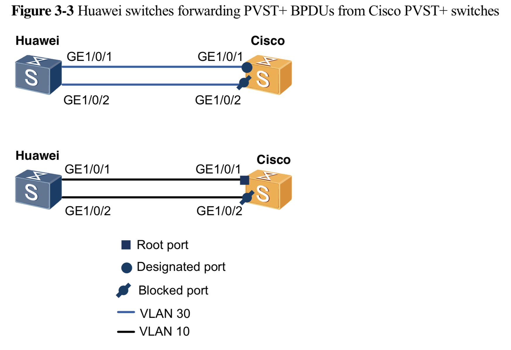

# Spanning Tree Protocol

# Links

* [Spanning Tree Protocol - Wikipedia](https://en.wikipedia.org/wiki/Spanning_Tree_Protocol)
* [Bridge Protocol Data Unit - Wikipedia](https://en.wikipedia.org/wiki/Bridge_Protocol_Data_Unit)
* [HUAWEI_Sx700_Switch_Interoperation_with_PVST_Technical_White_Paper.pdf](https://atlasgentech.co.nz/media/wysiwyg/pdf/Huawei/Data-Switches/HUAWEI_Sx700_Switch_Interoperation_with_PVST_Technical_White_Paper.pdf) 
* [Interoperation and Replacement Guide for Spanning Tree Protocols on Huawei and Cisco Switches - S2700, S3700, S5700, S6700, S7700, and S9700 Series Switches Typical Configuration Examples - Huawei](https://support.huawei.com/enterprise/en/doc/EDOC1000069520/ff734cfa/interoperation-and-replacement-guide-for-spanning-tree-protocols-on-huawei-and-cisco-switches)

# Comparison Between STP on Huawei and Cisco Switches

## Packet Processing Mode


Processing mode of Cisco PVST+ BPDUs (the implementation is similar to that of Rapid PVST+ BPDUs)

On a trunk interface:

* In VLAN 1, a PVST+ device sends standard STP BPDUs and untagged PVST BPDUs to
  negotiate with the remote device.

* In the native VLAN but not VLAN 1, a PVST+ device sends untagged PVST BPDUs
  to negotiate with the remote device.

* In other VLANs, a PVST+ device sends PVST BPDUs to negotiate with the remote
  device.

* A PVST+ device sends standard STP BPDUs to negotiate with the remote device
  in VLAN 1 after the no spanning-tree vlan 1 command is configured globally.

On an access interface:

* In all VLANs, a PVST+ device sends standard STP BPDUs to negotiate with the
  remote device.


Processing of Huawei VBST BPDUs

On a trunk interface:

* In VLAN 1, a VBST-enabled device sends standard STP or RSTP BPDUs and VBST
  BPDUs to negotiate with the remote device.

* In other VLANs, a VBST-enabled device sends VBST BPDUs to negotiate with the
  remote device.

On an access interface:

A VBST-enabled device sends standard STP or RSTP BPDUs to negotiate with the
remote device only in the VLAN where the access interface is located.

# Differences in Command Formats

Function|Huawei|Cisco
|:---|:---|:---
|Configure a spanning tree mode.|stp mode|spanning-tree mode
|Configure a path cost algorithm.|stp pathcost-standard|spanning-tree pathcost method
|Configure a fast transition mode on an interface.|stp no-agreement-check|N/A
|Enable digest snooping.|stp config-digest-snoop|N/A
|path cost algorithms|display stp|show spanning-tree detail
|IEEE 802.1t|stp pathcost-standard dot1t|spanning-tree pathcost method long
|IEEE 802.1d-1998|stp pathcost-standard dot1d-1998|spanning-tree pathcost method short
|Check the digest information.|display stp region-configuration digest|show spanning-tree mst digest
|Enable digest snooping.|stp config-digest-snoop|N/A

# BPDU

**Bridge Protocol Data Units (BPDUs)** are frames that contain information
about the spanning tree protocol (STP). A switch sends BPDUs using a unique MAC
address from its origin port and a multicast address as destination MAC
(`01:80:C2:00:00:00`, or `01:00:0C:CC:CC:CD` for Per VLAN Spanning Tree).

# History

* The first spanning tree protocol was invented in 1985 at the Digital
  Equipment Corporation by [Radia
  Perlman](https://en.wikipedia.org/wiki/Radia_Perlman).In 1990, the IEEE
  published the first standard for the protocol as 802.1D,[16] based on the
  algorithm designed by Perlman.

* In 2001, the IEEE introduced Rapid Spanning Tree Protocol (RSTP) as `802.1w`.
  RSTP was designed to be backwards-compatible with standard STP. 

* STP was originally standardized as `IEEE 802.1D` but the functionality of
  spanning tree (802.1D), rapid spanning tree (`802.1w`), and multiple spanning
  tree (`802.1s`) has since been incorporated into `IEEE 802.1Q-2014`.

# Spanning Tree Protocol standards for VLANs

STP and RSTP do not segregate switch ports by VLAN.

Cisco developed, implemented and published the **Per-VLAN Spanning Tree
(PVST)** proprietary protocol using **its own** proprietary **Inter-Switch Link
(ISL)** for VLAN encapsulation, and `PVST+` which uses 802.1Q VLAN encapsulation. 

Cisco also published a proprietary version of Rapid Spanning Tree Protocol. It
creates a spanning tree for each VLAN, just like PVST. Cisco refers to this as
Rapid Per-VLAN Spanning Tree (RPVST). 

# Configuring a spanning tree

Configuring STP and RSTP on switches in a LAN follows the same principles. STP
must be enabled on all switches in the LAN and the version of STP must be
chosen. All switches must use the same version of STP. 

The root bridge of the spanning tree is the bridge with the smallest (lowest)
bridge ID. Each bridge has a configurable priority number and a MAC address;
the bridge ID is the concatenation of the bridge priority and the MAC address.
For example, the ID of a bridge with priority `32768` and mac `0200.0000.1111`
is `32768.0200.0000.1111`. 

# Cisco PVST+

Cisco Catalyst series switches of IOS 12.2 and later versions support `PVST+`,
`Rapid PVST+`, and `MST`. Some bridge protocol data units (BPDUs) of PVST+,
Rapid PVST+, and MST use Cisco proprietary BPDU formats, which are different
from the standard BPDU format defined by Institute of Electrical and
Electronics Engineers (IEEE). Trunk ports on PVST+ or Rapid PVST+ capable Cisco
switches send Cisco proprietary BPDUs in VLANs other than VLAN 1. 

**The destination MAC address of PVST BPDUs is 01-00-0C-CC-CC-CD; therefore,
PVST cannot interoperate with standard IEEE spanning tree protocols.**

PVST+ improves PVST by adding interoperability with standard spanning tree
protocols. On an access port, PVST+ sends standard STP BPDUs in its native
VLAN. On a trunk port, PVST+ sends standard STP BPDUs with the destination MAC
address of 01-80-C2-00-00-00 only in VLAN 1, and sends Cisco proprietary BPDUs
with the destination MAC address of 01-00-0C-CC-CC-CD in other VLANs allowed by
the trunk port. Huawei switches transparently transmit Cisco proprietary BPDUs
as common multicast frames.

Rapid PVST+ is an extension of PVST+. Compared with PVST+, Rapid PVST+ uses the
Rapid Spanning Tree Protocol (RSTP) mechanism to implement rapid transition.

Cisco MST supports VLAN-instance mapping and defines the concept of domain;
therefore, it can be considered as a standard MSTP protocol. MST BPDUs use the
standard format defined by IEEE. Huawei and Cisco switches use different keys
to generate MSTP digests in BPDUs. By default, MSTP and Cisco MST can implement
only inter-domain interoperation because Huawei and Cisco switches generate
different digests. To enable MSTP and Cisco MST to interoperate within an MPST
domain, enable the digest snooping function on a Huawei switch's port connected
to a Cisco switch.

# Interoperation Networking Design


PVST+ is a Cisco proprietary protocol that uses a Cisco reserved multicast MAC
address. Huawei switches do not support Cisco PVST+. The following methods can
implement interoperation between Cisco PVST+ switches and Huawei switches:

* On a trunk port, Cisco PVST+ sends two types of BPDUs in VLAN 1: untagged
  Cisco PVST+ proprietary BPDUs and standard RSTP BPDUs. Huawei switches can
  identify RSTP BPDUs. When a Huawei switch connects to a trunk port of a Cisco
  PVST+ switch, enable RSTP or MSTP on the Huawei switch so that it can work
  with the Cisco PVST+ switch.

* On an access port, Cisco PVST+ sends standard BPDUs. When a Huawei switch
  connects to an access port of a Cisco RVST+ switch, enable RSTP or MSTP on
  the Huawei switch.

* (Not recommended) Huawei switches forward Cisco PVST+ BPDUs as service
  packets to access the Cisco PVST+ network. In this mode, the blocked ports
  are located on Cisco switches.

# Example 1: Interoperation Between Huawei Switches (Root Bridge) and Cisco PVST+ Switches

Huawei switches do not support Cisco PVST+ and they run MSTP or RSTP to
interoperate with Cisco switches. Load balancing is required, so a Huawei
switch must be configured as the root bridge. When Huawei switches run MSTP,
their ports connected to Cisco switches automatically switch to the RSTP mode,
so the MSTP and RSTP modes have the same effect on Cisco PVST+ switches.



**Configuration Methods**

* On Cisco switches: Configure the same path cost algorithm on all Cisco
  switches. Set an appropriate bridge priority for VLAN 1 to ensure that it is
  lower than the bridge priority of Huawei CST, and set bridge priorities for
  other VLANs based on the site requirements.

* On Huawei switches: Configure the same path cost algorithm on all Huawei
  switches.Ensure that the bridge priority of Huawei CST is higher than that of
  Cisco VLAN 1.

**Configuration Files**

Cisco

```
spanning-tree mode rapid-pvst
spanning-tree logging
spanning-tree extend system-id
spanning-tree vlan 1 priority 4096
spanning-tree pathcost method long
!
interface GigabitEthernet1/0/1
 switchport trunk encapsulation dot1q
 switchport trunk allowed vlan 1,30
 switchport mode trunk
 spanning-tree vlan 30 port-priority 48
end
!
interface GigabitEthernet1/0/2
 switchport trunk encapsulation dot1q
 switchport trunk allowed vlan 1,30
 switchport mode trunk
end
```

Huawei

```
stp root primary
#
interface GigabitEthernet1/0/1
undo shutdown
port link-type trunk
port trunk allow-pass vlan 30
#
interface GigabitEthernet1/0/2
undo shutdown
port link-type trunk
port trunk allow-pass vlan 30
#

// may be useful
stp mode vbst
stp pathcost-standard dot1d-1998
interface gigabitethernet 1/0/1
stp no-agreement-check
#
interface gigabitethernet 1/0/2
stp no-agreement-check
#
```

**Notes:**

* Ensure that spanning trees in all VLANs use a Huawei switch as the root
  bridge.

* Configure Huawei switches to work in MSTP or RSTP mode, and do not use the
  STP-compatible mode.

* Cisco native VLAN traffic is untagged, so the PVID on Huawei switches must be
  the same as the native VLAN ID on Cisco switches.

# Example 2: Interoperation Between Huawei Switches and Cisco PVST+ Switches (Root Bridge)

Load balancing is not required, so a Cisco PVST+ switch can be configured as
the root bridge.



Methods

* On Cisco switches: Configure a Cisco switch as the PVST+ root bridge.
  Configure the same path cost algorithm on all Cisco switches. Set an
  appropriate bridge priority for VLAN 1 to ensure that it is higher than the
  bridge priority of Huawei CST.

* On Huawei switches: Configure the same path cost algorithm on all Huawei
  switches.Ensure that the bridge priority of Huawei CST is lower than that of
  Cisco VLAN 1.

**Configuration Files**

Cisco

```
spanning-tree mode rapid-pvst
spanning-tree logging
spanning-tree extend system-id
spanning-tree vlan 1 priority 0
spanning-tree pathcost method long
!
interface GigabitEthernet1/0/1
 switchport trunk encapsulation dot1q
 switchport trunk allowed vlan 1,30
 switchport mode trunk
end
!
interface GigabitEthernet1/0/2
 switchport trunk encapsulation dot1q
 switchport trunk allowed vlan 1,30
 switchport mode trunk
end
```

Huawei

```
interface GigabitEthernet1/0/1
undo shutdown
port link-type trunk
port trunk allow-pass vlan 30
#
interface GigabitEthernet1/0/2
undo shutdown
port link-type trunk
port trunk allow-pass vlan 30
#
```

# Example 3: Interoperation with Cisco PVST+ Switches by Forwarding PVST+ BPDUs

Cisco switches do not process BPDUs of VLAN 1 forwarded by Huawei switches.
Therefore, this plan applies only to VLANs other than VLAN 1.



Methods

* On Cisco switches: Configure a Cisco switch as the PVST+ root bridge.
  Configure the same path cost algorithm on all Cisco switches.

* On Huawei switches: Add ports connected to Cisco switches to the
  corresponding Cisco PVST VLANs. The ports do not participate in STP
  calculation.

**Configuration Files**

Cisco

```
spanning-tree mode pvst
spanning-tree logging
spanning-tree extend system-id
spanning-tree pathcost method long
!
interface GigabitEthernet1/0/1
 switchport trunk encapsulation dot1q
 switchport trunk allowed vlan 1,30
 switchport mode trunk
end
!
interface GigabitEthernet1/0/2
 switchport trunk encapsulation dot1q
 switchport trunk allowed vlan 1,30
 switchport mode trunk
end
```

Huawei

```
interface GigabitEthernet1/0/1
undo shutdown
port link-type trunk
port trunk allow-pass vlan 30
stp disable
#
interface GigabitEthernet1/0/2
undo shutdown
port link-type trunk
port trunk allow-pass vlan 30
stp disable
#

// These commands may be useful
interface eth-trunk 1
l2protocol-tunnel PVST+ enable
l2protocol-tunnel STP enable
#
interface gigabitethernet 1/0/1
l2protocol-tunnel PVST+ enable
l2protocol-tunnel STP enable
#
interface gigabitethernet 1/0/2
l2protocol-tunnel PVST+ enable
l2protocol-tunnel STP enable
quit
```

Notes

* Do not enable STP on Huawei switch ports that transparently transmit Cisco
  PVST+ BPDUs. Otherwise, these ports cannot forward PVST+ BPDUs but still send
  BPDUs, which interfere with PVST+ calculation on Cisco switches.

* Cisco native VLAN traffic is untagged, so the PVID on Huawei switches must be
  the same as the native VLAN ID on Cisco switches.


